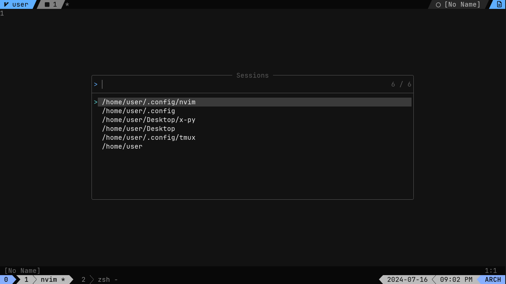
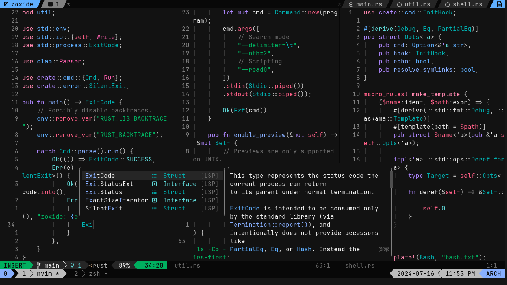
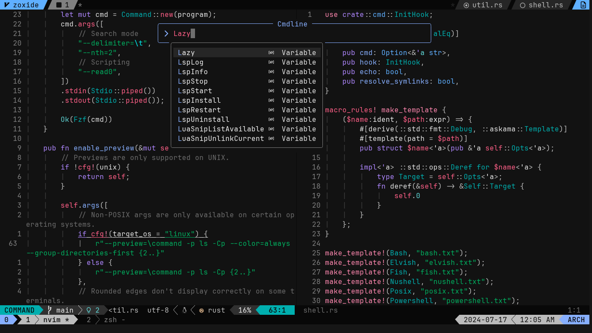
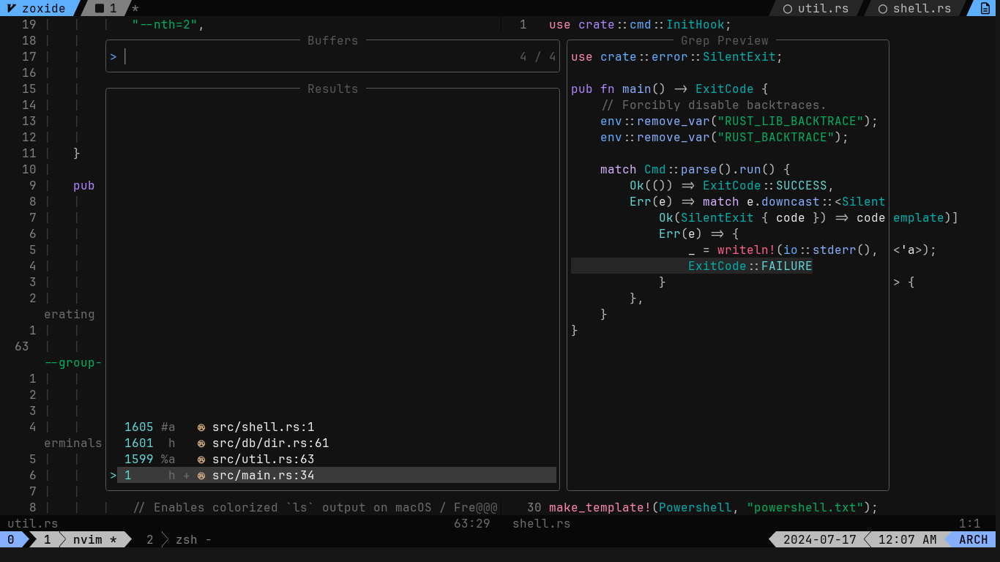

# nvim-config
Personal neovim config files (written in lua)
### ⚙️ Core plugins
* Plugin manager - [lazy.nvim](https://github.com/folke/lazy.nvim)
* Theme - [Nightfox (Carbonfox)](https://github.com/EdenEast/nightfox.nvim?tab=readme-ov-file#carbonfox)
* LSP integration - [nvim-lspconfig](https://github.com/neovim/nvim-lspconfig) + [mason.nvim](https://github.com/williamboman/mason.nvim)
* Autocompletion - [nvim-cmp](https://github.com/hrsh7th/nvim-cmp)
* Navigation - [mini.files](https://github.com/echasnovski/mini.nvim/blob/main/readmes/mini-files.md), [telescope.nvim](https://github.com/nvim-telescope/telescope.nvim)
* UI - [tabby.nvim](https://github.com/nanozuki/tabby.nvim), [lualine.nvim](https://github.com/nvim-lualine/lualine.nvim), [noice.nvim](https://github.com/folke/noice.nvim)

### 📂 File Structure
<pre>
~/.config/nvim
├── lua/
│   └── nvim/ 
│       ├── core/
│       │   ├── colorscheme.lua
│       │   ├── keymaps.lua
│       │   └── options.lua
│       ├── plugins
│       │   ├── plugin group 1/
│       │   │   ├── plugin1.lua
│       │   │   ├── ***
│       │   │   └── plugin5.lua
│       │   ├── ***
│       │   └── plugin group 4/
│       └── lazy.lua
│
└── init.lua
</pre>
### 📷 Screenshots
   
---

(More dotfiles [here](https://github.com/assense/dotfiles))

Enjoy!
